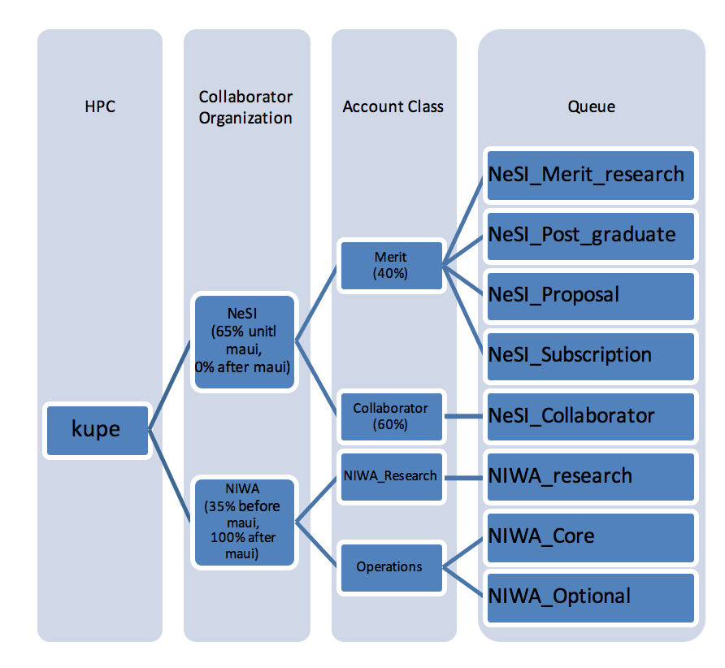

## Cray XC50

The following Slurm queues are set up on Kupe

| Queue | Job Limit| | User Limit ||
| --- | --- | --- |---| ---|
| | Node | Wall Time | Node | Job |
| NeSI\_Merit\_research | 24 | 96:00 | 24 | 5 |
| NeSI\_Subscription |  24 | 96:00 | 24 | 5 |
| NeSI\_Post\_graduate |  24 | 96:00 | 24 | 5 |
| NeSI\_Proposal | 1 | 30 | 1 | 1 |
| NeSI\_mDebug | 2 | 30 | 2 | 2 |
| NeSI\_Collaborator | 39 | 96:00 | 39 | 6 |
| NeSI\_cDebug | 2 | 30 | 2 | 2 |
| NIWA\_Research | 36 | 3:00 | 36 | 10 |
| NIWA\_Core |36 | 3:00 | 36 | 10 |
| NIWA\_Optional |36 | 3:00 | 36 | 10 |

Job and user limits are attached to the account (Project Code).  The queues draw from the different allocations.  The Scavenge queue limits the jobs to 1 node for 10 minutes. Right now there are no User QoS for Kupe.

| Partition |   |
| --- | --- |
| Operations | High priority queue for use with NIWA\_Core and NIWA\_Optional draws from the NIWA allocation |
| NeSI | Queue that draws from the NeSI allocation. |
| NIWA\_Research | Draws from the NIWA allocation and can be requeued by jobs in the Operation queue. |
| NiWA\_forage | Draws from the NeSI allocation if available. Jobs can be pre-empted by cancel by jobs in the NeSI queue. |
| NeSI\_forage | Draws from the NIWA allocation.  Jobs can be pre-empted by cancel to make room for jobs in the Operations or NIWA\_Research queue. |
| Scavenge | Draws from both NIWA and NeSI allocation and will only run after all jobs from all higher priority queues.  These jobs can be cancelled to make room for jobs submitted to the other queues. |

## Cray CS500 Multi-Purpose Nodes

Details coming soon.

## Queue limits on Kupe

Queue limits reflect the NIWA-NeSI allocation and the Merit-Collaboration allocation within the NeSI allocation.  The base allocations are NIWA-Only 36 nodes, NeSI-Merit 27 nodes and NeSI Collaborator 41 nodes.  An option to allow “NeSI” jobs to spill over into NIWA owned capacity (and vice versa) in each class offers 9 nodes for foraging.  With the foraged nodes this brings the allocations to NIWA-only to 45 nodes and NeSI-Merit 31 nodes and NeSI Collaborator 46 nodes.   To access the foraged nodes a job indicates that it can be preempted by a forage policy.  Available policies include cancel, checkpoint and requeue.

The basic queues are size neutral.  User limit cap the size of the job and steer the user toward jobs between broad and narrow.  By setting the base wall time limit to 96:00 default jobs being either LN or LB resulting in low queue velocity.   Setting a lower default wall time either in the project account or by the user results in higher job velocity.  Priority will move jobs of similar size ahead of the lower priority jobs.  The gap between the queue limit and the broadest job ensures that narrow jobs have an opportunity to run.

**The bottom line is – it is important to request only the resources your job really needs, as this will improve the queue velocity of all jobs.**
