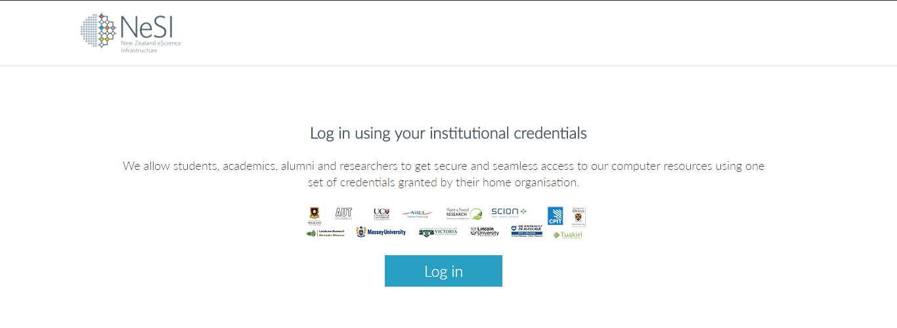
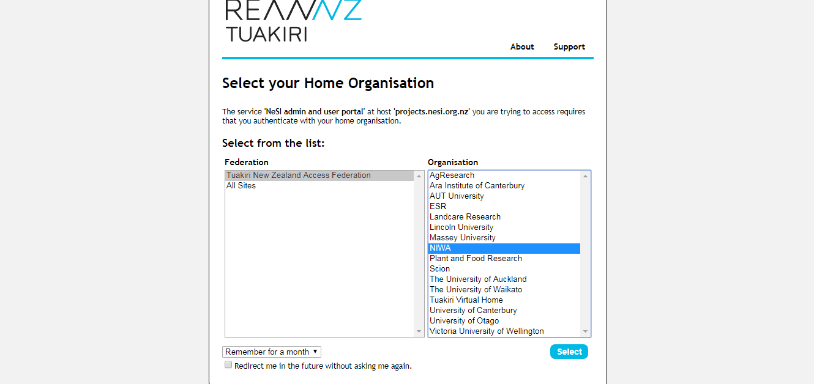
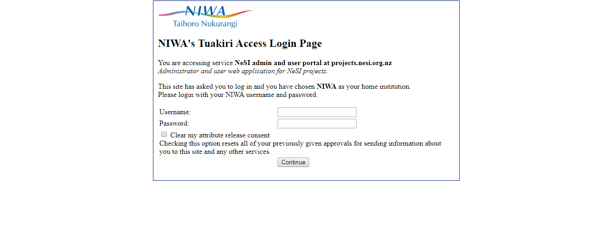
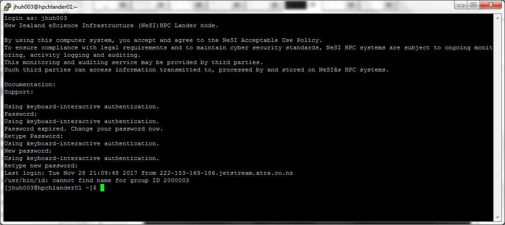
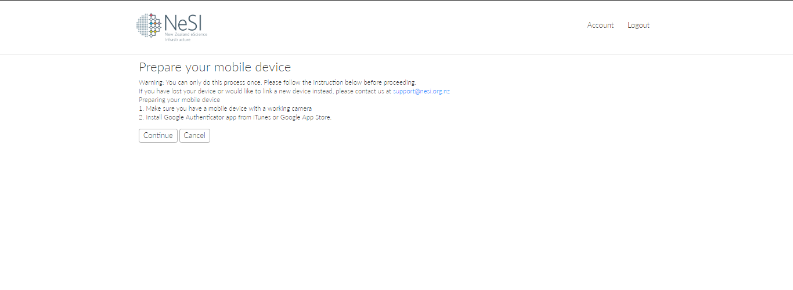
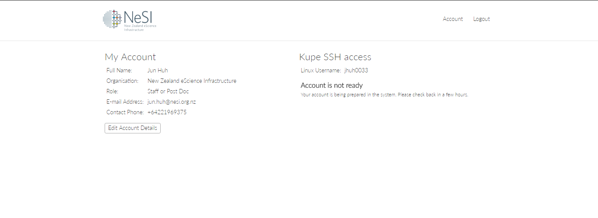

You will learn how to set up your account on Kupe and how to log in onto the machine.

### Requirements

You will need a terminal program to log into Kupe:

- Windows: MobaXterm, Windows 10 bash, Putty
- MacOS X: Terminal app, iTerm2
- Linux: Terminal app, xterm

You will need an [account](#account). If connecting from outside NIWA's network, you will need two 
[factor authentication](#Setting-up-two-factor-authentication) set up.

### Connecting to kupe

For users outside of NIWA, connect to kupe by typing
```
ssh -Y <my_username>@lander.nesi.org.nz
```
inside your terminal program, and using your password and second factor to authenticate. E.g. mypassword345678 where 345678 is your 6-digit code from the mobile. See below on how to set up two factor authentication. 

Once you're on the lander node or if connecting from inside NIWA or from NIWA's VPN, connect to kupe using
```
ssh -Y <my_username>@login.kupe.niwa.co.nz
```
then enter your password. **Note** If you have your 2nd factor set, you must type your password followed immediately by the 2nd factor token. E.g. mypassword345678 where 345678 is your 6-digit code from the mobile. This may change in the future. 


### <a name="account"></a> Setting up an account on Kupe

If you are logging in for the first time to Kupe, you will need to set up your account. First, you will need to log in to NeSI user portal. This populates NeSI database with your basic account information which will be used to set up your account.

1. Access [My NeSI  Portal](https://my.nesi.org.nz) via your browser.
 
2. Log in using your institutional credentials via Tuakiri. See example below for logging in with NIWA credentals.




3. After successful login, you should see a screen similar to the one below


4. Please click on ‘Reset Password’ button to proceed. It will send you an e-mail with temporary URL.


**Note** If you don’t see ‘Reset Password’ button and instead see error messages, it means your information on our database did not match your Tuakiri identity. Please see the bottom of the page for troubleshooting section and contact Aaron and Jun at aaron.hicks@nesi.org.nz and jun.huh@nesi.org.nz, and provide us with your name and e-mail address and we will fix your account.

5. Clicking on the link on your e-mail will open up the following page that shows your temp password.


Connecting to the HPC requires two-factor authentication at all times, your password, and an additional factor. These additional factors can be:
- A keycode provided by an external generator (e.g., via smartphone app)
- Connecting from NIWA's physical network (at a NIWA branch)
- Connecting through a NIWA VPN session

### Setting up two factor authentication

Note: You can skip this section if you log on from inside the NIWA network or via NIWA's VPN.

Go back to My NeSI portal and click on Accounts or refresh the page and you will see a new option to ‘Link your mobile device’


Clicking on link your mobile device will prepare your 2nd factor login so that you can log in to our lander node from outside of the NIWA network.

After clicking on ‘Link your mobile device’ you will be instructed to prepare your mobile device before proceeding.


Please make sure you have a mobile device with a working camera and then install Google Authenticator app (free). The next step can only be done once.

Click ‘Continue’ and scan your QR code


Open your Google Authenticator app and click on the add button and select ‘Scan a barcode’. Point your camera at the QR code displayed on the screen and it will be added to your phone.

Log in to lander


Now logging in to the lander node will prompt you for ‘First factor’ where you enter your newly set password, and ‘Second factor’ which is the 6 digit code displayed on your Google Authenticator app. The 6 digit code rotates every 30 seconds, and it can only be used once. This means that you can only log in to the lander node once every 30 seconds. Also the prompt says (optional), but it is not optional, and we are working to fix the message.

### Setting up access for connecting from outside of NIWA computer network (advanced)

On most Linux and MacOS machines the login process can be simplified to just a single SSH command, jumping across the lander node on the way to kupe. With the following lines in your `~/.ssh/config` file you can run the command `ssh kupe` on your machine and it will take you straight to kupe. Since we are using SSH ProxyCommand to jump first to the lander node, you will need to enter your ‘First factor’ (password) and then your ‘Second factor’ (from Google Authenticator) on the first jump and then a combination of your ‘First factor’+‘Second factor’ on the second jump when prompted for a password. 
```
Host kupe
   User your_username
   Hostname login.kupe.niwa.co.nz
   ProxyCommand ssh -W %h:%p lander
   ForwardX11 yes
   ForwardX11Trusted yes
   ServerAliveInterval 300
   ServerAliveCountMax 2

Host lander
   User your_username
   HostName lander.nesi.org.nz
   ForwardX11 yes
   ForwardX11Trusted yes
   ServerAliveInterval 300
   ServerAliveCountMax 2
```
The `ForwardX11` directives will enable X11 forwarding and are optional. This can be combined with the `Control` directives to make additional SSH logins and transferring data easier (see the [data transfer](009-data_transfer.md) page).

### Troubleshooting
After you logged into the MyNeSI Portal, you may see one of the following screens. Please contact Aaron and Jun at aaron.hicks@nesi.org.nz and jun.huh@nesi.org.nz, and provide us with your name and e-mail address and we will fix your account. Also, let us know which of the following screen you see, and we will be able to address your issue quicker. Thank you.

If your account is not ready, you may see:


If your project is not set up, you may see:


