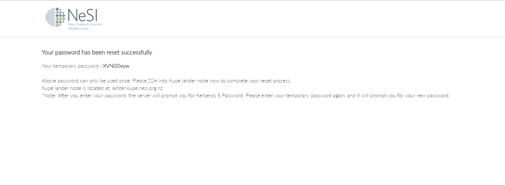
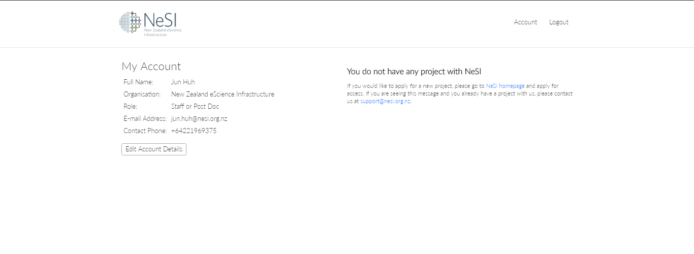

## Outline

You will learn how to:

 1. setup your account on kupe
 2. setup two factor authentication (if connecting from outside NIWA's network)
 3. login to the machine

## Requirements

You will need a terminal program to login to Kupe:

- Windows: [MobaXterm](https://mobaxterm.mobatek.net/), Windows 10 bash, or [Putty](https://www.putty.org/)
- MacOS X: Terminal app, iTerm2
- Linux: Terminal app, xterm

---

## Connecting to kupe

### Users outside of NIWA

Connecting to kupe is a two step process. First, connect to kupe's lander node
```
ssh -Y <myusername>@lander.nesi.org.nz
```
inside your terminal program, where ```<myusername>``` is your account user name. You will see the following prompt
```
First Factor:
```
Enter your password, followed by
```
Second Factor (optional):
```
Enter the 6-digit code from the mobile device. To execute and compile code, you will as a second step connect to the login node
```
ssh -Y login
```
using your password followed immediately by the 2nd factor token. E.g. mypassword345678 where 345678 is your 6-digit code from the mobile.

### Users inside of NIWA's network

You can connect directly to kupe's login node
```
ssh -Y <myusername>@login.kupe.niwa.co.nz
```
using your password. **Note: if you have two-factor authentication set up then you need to provide mypassword345678 where 345678 is your 6-digit code from the mobile at the password prompt.**

---

## Setting up an account on Kupe

If you are logging in for the first time to Kupe, you will need to set up your account. First, you will need to login to NeSI user portal. This populates NeSI database with your basic account information which will be used to set up your account.

1. Access [My NeSI  Portal](https://my.nesi.org.nz) via your browser.
   

2. Log in using your institutional credentials via Tuakiri. Persons who come from outside the Tuakiri federation will have to apply for a Tuakiri Virtual Home account by emailing support@nesi.org.nz and select the Tuakiri Virtual Home as their Home Organisation. See example below shows logging in with NIWA credentals and login screen, please select your own home organisation.
   
   

3. After successful login, you should see a screen similar to the one below
   

4. Please click on ‘Reset Password’ button to proceed. It will send you an e-mail with temporary URL.

   **Note** If you don’t see ‘Reset Password’ button and instead see error messages, it means your information on our database did not match your Tuakiri identity, or your account or project has not yet have been approved or activated.. Please see the Troubleshooting section.

5. Clicking on the link on your e-mail will open up the following page that shows your temp password.


6. During your first login with the temporary password you will be asked to change it. This is a **4-step** process, detailed bellow. Once your password has changed sucessfully, your connection will be eventually terminated with `Permission denied (keyboard-interactive).`, this is normal until a second factor is set up.

      Reseting the temporary password **4-step** process:
   1. When you first issue the SSH command to login, a password will be asked (**this is the temporary password**)
   2. Immediately after entering the temporary password correctly, the system will report that the temporary password is expired and you will be asked to enter it again (_Current Password:_). **Enter the same temporary password again**
   3. Then, you will be asked for **your NEW password** (_New password:_)
   4. And finally you will be asked to **confirm your NEW password** (_Retype new password:_)
   5. Upon sucessfull password change, you might be asked for entering a password again (but this will not work just yet), do Ctrl+C on this step or just press 'Enter' until `Permission denied (keyboard-interactive).` is displayed.
   
   Example of the process:
   ```
   [user@host ~]# ssh -Y <username>@lander.nesi.org.nz
   New Zealand eScience Infrastructure (NeSI)HPC Lander node.

   By using this computer system, you accept and agree to the NeSI Acceptable Use Policy.
   To ensure compliance with legal requirements and to maintain cyber security standards, NeSI HPC systems are subject to ongoing monitoring, activity logging and auditing.
   This monitoring and auditing service may be provided by third parties.
   Such third parties can access information transmitted to, processed by and stored on NeSI’s HPC systems.

   Documentation:
   Support:

   Password: <temporary password>
   Password expired. Change your password now.
   Current Password: <temporary password>
   New password: <NEW password>
   Retype new password: <NEW password>
   Password: <Enter or Ctrl+C>
   Password: <Enter or Ctrl+C>
   Permission denied (keyboard-interactive).
   [user@host ~]#
   ```

   If it happens that you entered more than 4 passwords, something wrong might have happened (wrong password entered, password minimal requirements not met, accidentally pressed enter or Ctrl+C). If this is the case, close that session and start over again.

   **NOTE:** The NeSI password policy is:
   - 12 character minimum
   - minimum of 2 character types
   
7. You are now ready to move on to setting up two factor authentication

---

## Setting up two factor authentication

Note: You can skip this section if you log on from inside the NIWA network or via NIWA's VPN.

Connecting to the HPC requires two-factor authentication at all times, your password, and an additional factor. These additional factors can be:
- A keycode provided by an external generator (e.g., via smartphone app)
- Connecting from NIWA's physical network (at a NIWA branch)
- Connecting through a NIWA VPN session

Please make sure you have a mobile device with a working camera and then install Google Authenticator app (free). The next step can only be done once. 


**WARNING:** The QR code shown in later steps is a one-time password and can not be regenerated or displayed again. If you do not capture the QR code, or lose the device storing the token, you will be unable to access your account and will need to contact support@nesi.org.nz to have your token deleted so another can be generated for your account.

Go back to My NeSI portal and click on Accounts or refresh the page and you will see a new option to ‘Link your mobile device’


Clicking on `Link your mobile device' will prepare your 2nd factor login so that you can login to our lander node from outside of the NIWA network. After clicking on ‘Link your mobile device’ you will be instructed to prepare your mobile device before proceeding.


Click ‘Continue’ and scan your QR code.


Open your Google Authenticator app and click on the add button and select ‘Scan a barcode’. Point your camera at the QR code displayed on the screen and it will be added to your phone.

Now logging in to the lander node will prompt you for ‘First factor’ where you enter your newly set password, and ‘Second factor’ which is the 6 digit code displayed on your Google Authenticator app. The 6 digit code rotates every 30 seconds, and it can only be used once. This means that you can only login to the lander node once every 30 seconds. Also the prompt says (optional), but it is not optional, and we are working to fix the message.


**Note:** You need to part of an active project to login after you complete this step. If you beleive to be on an active project and you still are not able to log using your credentials, contact us via support@nesi.org.nz.

---

## Setting up access for connecting from outside of NIWA computer network (advanced)

On most Linux and MacOS machines the login process can be simplified to just a single SSH command, jumping across the lander node on the way to kupe. With the following lines in your `~/.ssh/config` file you can run the command `ssh kupe` on your machine and it will take you straight to kupe. Since we are using SSH ProxyCommand to jump first to the lander node, you will need to enter your ‘First factor’ (password) and then your ‘Second factor’ (from Google Authenticator) on the first jump and then a combination of your ‘First factor’+‘Second factor’ on the second jump when prompted for a password. 
```
Host kupe
   User your_username
   Hostname login.kupe.niwa.co.nz
   ProxyCommand ssh -W %h:%p lander
   ForwardX11 yes
   ForwardX11Trusted yes
   ServerAliveInterval 300
   ServerAliveCountMax 2

Host lander
   User your_username
   HostName lander.nesi.org.nz
   ForwardX11 yes
   ForwardX11Trusted yes
   ServerAliveInterval 300
   ServerAliveCountMax 2
```
The `ForwardX11` directives will enable X11 forwarding and are optional. This can be combined with the `Control` directives to make additional SSH logins and transferring data easier (see the Data Transfer lesson).

---

## Troubleshooting

Please contact support@nesi.org.nz if you have any problems or questions. Also, let us know which of the following screen you see as this will enable us to address your issue more quickly. Thank you.

If your account is not ready, you may see:


If your project is not set up, you may see:

