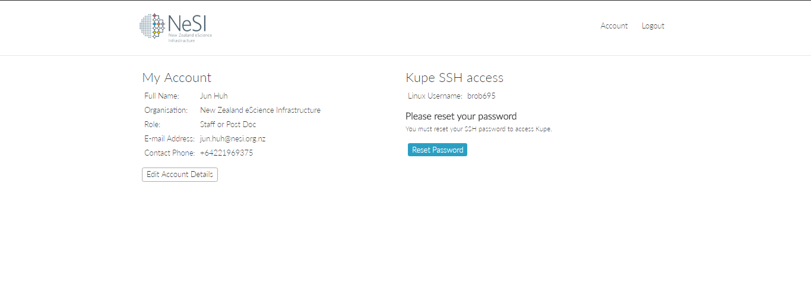
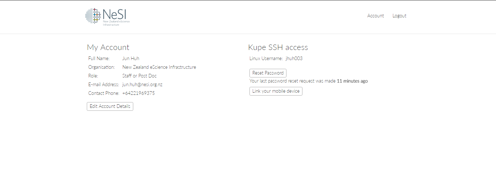

## Objectives

You will learn:

* how to set up your account for Maui and Mahuika
* how to set up two factor authentication

**Note:** if you already have access to Kupe then you do not need to do anything here.

## Requirements

You will need a terminal program to complete this process:

- Windows: [MobaXterm](https://mobaxterm.mobatek.net/), Windows 10 bash, or [Putty](https://www.putty.org/)
- MacOS X: Terminal app, iTerm2
- Linux: Terminal app, xterm

## Setting up an account for Maui and Mahuika

If you are logging in for the first time to Maui or Mahuika, you will need to set up your account. First, you will need to login to the NeSI user portal. This populates NeSI's database with your basic account information, which will be used to set up your account.

1. Access [My NeSI Portal](https://my.nesi.org.nz) via your browser.
   

2. Log in using your institutional credentials via Tuakiri. Persons who come from outside the Tuakiri federation will have to apply for a Tuakiri Virtual Home account by emailing [support@nesi.org.nz](mailto:support@nesi.org.nz) and select the Tuakiri Virtual Home as their Home Organisation. The example below shows logging in with NIWA credentals and the associated login screen; please select your own home organisation.
   
   

3. After successful login, you should see a screen similar to the one below
   

4. Please click on the ‘Reset Password’ button to proceed. It will send you an e-mail with temporary URL.

   **Note** If you don’t see the ‘Reset Password’ button and instead see an error messages, it means your information in our database did not match your Tuakiri identity, or your account or project has not yet been approved or activated. Please see the Troubleshooting section.

5. Clicking on the link in your e-mail will open up the following page that shows your temporary password.


6. During your first login with the temporary password you will be asked to change it. This is a **4-step** process, detailed bellow. Once your password has changed sucessfully, your connection will be eventually terminated with `Permission denied (keyboard-interactive).` or `Access denied (keyboard-interactive).`. This is normal until a second factor is set up.

   **Note:** The NeSI password policy is 12 characters minimum and a minimum of 2 character types.

   Resetting the temporary password **4-step** process:
   1. When you first issue the SSH command to login, a password will be required (**this is the temporary password**)
   2. Immediately after entering the temporary password correctly, the system will report that the temporary password is expired and you will be asked to enter it again (_Current Password:_). **Enter the same temporary password again**
   3. Then, you will be asked for **your NEW password** (_New password:_)
   4. And finally you will be asked to **confirm your NEW password** (_Retype new password:_)
   5. Upon sucessfull password change, your session will be either closed or you might be asked to enter a password again (but this will not work just yet). Upon this do Ctrl+C or just press 'Enter' until you get the `...denied (keyboard-interactive).` message.
   
   Example of the process:
   ```
   [user@host ~]# ssh -Y <username>@lander.nesi.org.nz
   New Zealand eScience Infrastructure (NeSI)HPC Lander node.

   By using this computer system, you accept and agree to the NeSI Acceptable Use Policy.
   To ensure compliance with legal requirements and to maintain cyber security standards, NeSI HPC systems are subject to ongoing monitoring, activity logging and auditing.
   This monitoring and auditing service may be provided by third parties.
   Such third parties can access information transmitted to, processed by and stored on NeSI’s HPC systems.

   Documentation:
   Support:

   Password: <temporary password>
   Password expired. Change your password now.
   Current Password: <temporary password>
   New password: <NEW password>
   Retype new password: <NEW password>
   Password: <Enter or Ctrl+C>
   Password: <Enter or Ctrl+C>
   Access/Permission denied (keyboard-interactive).
   [user@host ~]#
   ```

   If you entered more than 4 passwords, something wrong might have happened (wrong password entered, password minimal requirements not met, accidentally pressed enter or Ctrl+C). If this is the case, close that session and start over again.


7. You are now ready to move on to setting up two factor authentication

---

## Setting up two factor authentication

Connecting to the HPC requires two-factor authentication at all times: your password and an additional factor. This additional factor is a keycode provided by an external generator (e.g., via a smartphone app).

Please make sure you have a mobile device with a working camera and then install the Google Authenticator app (free). The next step can only be done once. 


**WARNING:** The QR code shown in later steps is a one-time password and can not be regenerated or displayed again. If you do not capture the QR code, or lose the device storing the token, you will be unable to access your account and will need to contact [support@nesi.org.nz](mailto:support@nesi.org.nz) to have your token deleted so another can be generated for your account.

Go back to [My NeSI portal](https://my.nesi.org.nz) and click on Accounts or refresh the page and you will see a new option to ‘Link your mobile device’



Clicking on `Link your mobile device' will prepare your 2nd factor login so that you can login to our lander node from outside of the NIWA network. After clicking on ‘Link your mobile device’ you will be instructed to prepare your mobile device before proceeding.


Click ‘Continue’ and scan your QR code.


Open your Google Authenticator app and click on the add button and select ‘Scan a barcode’. Point your camera at the QR code displayed on the screen and it will be added to your phone.

Now logging in to the lander node will prompt you for ‘First factor’ where you enter your newly set password, and ‘Second factor’ which is the 6 digit code displayed on your Google Authenticator app. The 6 digit code rotates every 30 seconds, and it can only be used once. This means that you can only login to the lander node once every 30 seconds. Also the prompt says (optional), but it is not optional, and we are working to fix the message.


**Note:** You need to part of an active project to login after you complete this step. If you believe to be on an active project and you still are not able to log using your credentials, contact us via [support@nesi.org.nz](mailto:support@nesi.org.nz).

---

## Troubleshooting

Please contact [support@nesi.org.nz](mailto:support@nesi.org.nz) if you have any problems or questions. Also, let us know which of the following screen you see as this will enable us to address your issue more quickly. Thank you.

If your account is not ready, you may see:


If your project is not set up, you may see:

